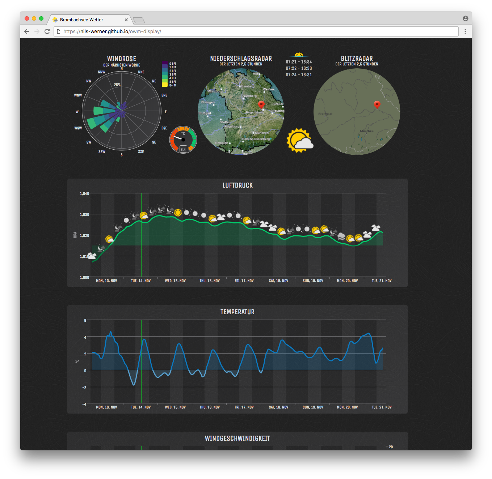

Weather Display
===============

This page is a small, HTML- and JS-only, website to show basic weather information for a sailing spot in southern germany.

## API Key

The API key must be provided using the URL hash, like

    index.html#!abcdef

## Custom Position

When using this site for any other spot, please set the `position` argument in the URL:

    index.html#!abcdef&position=41.145556,-73.995

Please note that this will not change the rain and lightning maps as they are
a bit of a hack and not using proper slippy maps.

## Query String Format

Alternatively the API key may be given as an named argument:

    index.html#!apikey=abcdef&position=41.145556,-73.995

Any query string delimiter like

    index.html#abcdef
    index.html#!abcdef
    index.html?abcdef

is possible.

## Related Projects

<https://github.com/nils-werner/raspi-dashboard> is a dashboard for Arch Linux that automatically
boots into a browser.

<https://github.com/nils-werner/raspi-overlayroot> is a method of mounting your root filesystem read-only,
so unplugging power doesn't corrupt your filesystem, or your SD card doesn't wear down after a few months.

## Example

An example of this site can be found on <http://nils-werner.github.io/owm-display/>

Obviously you need to provide your own [API key](https://darksky.net/dev/).
